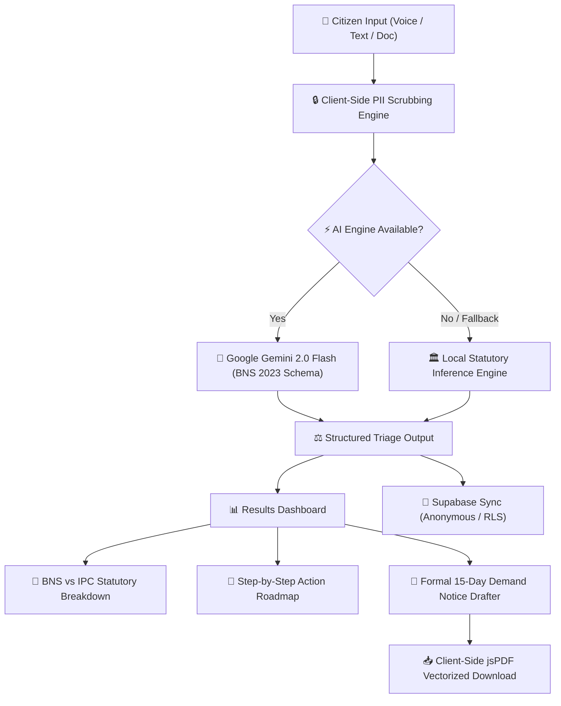

<p align="center">
  
</p>

<p align="center">
  <strong>AI-Powered Citizen Legal Triage & Automated Rights Navigator</strong><br>
  <em>Bridging the gap between 1.4 Billion Indian Citizens and Statutory Justice under Bharatiya Nyaya Sanhita (BNS 2023).</em>
</p>

<p align="center">
  <a href="https://nyayasetu.harshjha.me/"></a>
  <a href="https://github.com/Hix-001/SIH-2026"></a>
  
  
  
  
</p>

---

## ⚖️ Executive Summary

**NyayaSetu (Justice Bridge)** is a next-generation legal technology platform built for the **Smart India Hackathon (SIH 2026)** under the **Smart Automation** theme. It addresses the systemic problem of legal accessibility, statutory ambiguity, and high initial legal fees for Indian citizens facing everyday disputes—such as unlawful landlord actions, online financial fraud (UPI scams), consumer service deficiencies, and property conflicts.

Under **Article 39A of the Constitution of India** (Equal Justice and Free Legal Aid), NyayaSetu converts everyday natural language grievances into actionable, statutory intelligence under the newly enacted **Bharatiya Nyaya Sanhita (BNS 2023)**, **Bharatiya Nagarik Suraksha Sanhita (BNSS 2023)**, **Information Technology Act 2000**, and **Consumer Protection Act 2019**.

---

## 🚀 Key Architectural Innovations

### 1. 🏛️ BNS (2023) vs IPC Cross-Reference Engine
Automatically translates colloquial complaints into exact statutory sections under the new BNS 2023 legal framework, displaying:
* Newly codified BNS section numbers and legal definitions.
* Legacy IPC cross-reference index (e.g., Section 420 IPC $\to$ Section 318 BNS).
* Offence classification (Cognizable vs Non-Cognizable, Bailable vs Non-Bailable).
* Statutory limitation periods and maximum penalties.

### 2. 🔒 Zero-Knowledge Client-Side PII Redaction
Prior to any cloud or AI inference, sensitive Indian Personally Identifiable Information (PII) is masked directly inside the browser using cryptographic and entropy regex filters:
* **Aadhaar Numbers** (12-digit UIDAI masked to `XXXX-XXXX-1234`).
* **PAN Cards** (`XXXXX1234X`).
* **Indian Mobile Numbers** (`+91 98****3210`).
* **UPI Handles & Bank Account Numbers** (`ra***@okhdfcbank`).

### 3. 🗣️ Multilingual Voice & Indic Accessibility (22 Languages)
Powered by the Government of India's **Bhashini AI** standards and browser Web Speech APIs, citizens can speak or type in **Hindi, Tamil, Telugu, Bengali, Marathi, Gujarati, Kannada, Odia**, or English with real-time speech-to-text and native terminology preservation.

### 4. 📜 Automated Court-Compliant Legal Notice Generator
Generates formal, legally enforceable **15-day statutory demand notices** with:
* Formal legal headers and citizen-landlord/fraudster address blocks.
* Automated statutory citation clauses.
* Advocate verification signature placeholders and Certified Court Wax Seal stamps.
* Instant, client-side PDF export.

### 5. 🚨 Golden-Hour Emergency SOS Helplines
One-touch instant connectors for statutory emergency helplines:
* **1930:** National Cyber Crime Reporting Portal (Golden Hour Fraud Recovery).
* **1915:** National Consumer Helpline (NCH).
* **15100:** NALSA National Free Legal Aid Helpline.
* **112:** National Police Emergency Response.

---

## 🛠️ Comprehensive Tech Stack

| Layer | Technologies Used | Purpose |
| :--- | :--- | :--- |
| **Frontend Framework** | **React 18.3, TypeScript, Vite 5** | High-performance, type-safe Single Page Application. |
| **Styling & UI Design** | **TailwindCSS, Vanilla CSS, Framer Motion, Lucide Icons** | Translucent glassmorphism, responsive spring animations, luxury dark judiciary theme (`#060a24` & Gold). |
| **AI Reasoning Engine** | **Google Gemini 2.0 Flash (`gemini-2.0-flash`)** | Real-time legal triage inference with structured JSON output and BNS legal grounding. |
| **Local Inference Fallback** | **Rule-Based Legal Matching Engine (TypeScript)** | Zero-downtime statutory matching when offline or API is unavailable. |
| **Backend API Service** | **FastAPI (Python 3.11+), Uvicorn, Pydantic v2** | High-concurrency RESTful microservice with validation and CORS security. |
| **Database & Auth** | **Supabase (PostgreSQL)** | Persistent storage for triage records, mapped statutes, and legal drafts with Row Level Security (RLS). |
| **Voice Processing (STT/TTS)** | **Web Speech API (`SpeechRecognition`, `SpeechSynthesis`) + Bhashini AI** | 100% client-side, zero-latency speech recognition and text-to-speech audio reader. |
| **PDF Generation Engine** | **jsPDF & html2canvas** | Pure client-side document rendering and vectorized PDF compilation without server telemetry. |
| **Hosting & DNS** | **Vercel (Frontend SPA), Render (Dockerized API), Namecheap (DNS)** | Global CDN edge caching, automatic SSL, custom domain routing (`https://nyayasetu.harshjha.me/`). |

---

## 🔍 Deep Dive: How Voice AI & PDF Generation Work

### 🎙️ 1. Speech Recognition (STT) & Text-to-Speech (TTS)
> **Key Note:** Voice processing does **NOT** consume or send audio to Google Gemini API.

* **Speech-to-Text (STT):** Implemented in [`src/hooks/useSpeechRecognition.ts`](src/hooks/useSpeechRecognition.ts) using the browser's hardware-accelerated **Web Speech API (`webkitSpeechRecognition` / `SpeechRecognition`)**. When the citizen speaks, audio waveforms are transcribed directly on the device with local Indic language models (`hi-IN`, `ta-IN`, `te-IN`, `bn-IN`, `mr-IN`, `gu-IN`, `en-IN`), with fallback integration to Government of India's **Bhashini AI**.
* **Text-to-Speech (TTS):** Implemented in [`src/services/tts.service.ts`](src/services/tts.service.ts) using the browser's native **SpeechSynthesis API (`window.speechSynthesis`)**. It vocalizes rights and next steps in natural regional accents with zero cloud latency and zero API cost.
* **Why this architecture?** It guarantees **zero audio eavesdropping**, instantaneous response times, offline voice capture capability, and 100% free scalability for millions of citizens.

### 📄 2. Document & Legal Notice PDF Generator
> **Key Note:** Notice drafting and PDF compilation are executed **100% locally on the client's browser**.

* Implemented in [`src/services/pdfGenerator.ts`](src/services/pdfGenerator.ts) and [`src/components/results/LegalNoticeGenerator.tsx`](src/components/results/LegalNoticeGenerator.tsx).
* When a citizen generates a notice, the client engine dynamically binds the scrubbed dispute facts, selected BNS sections, and monetary claim amounts into a standard judicial legal notice layout.
* **`jsPDF`** vectorizes the layout into an A4 court document containing:
  - Standardized judicial notice headers and formal registered post markers.
  - Numbered paragraphs with statutory limitation timelines.
  - Advocate stamp box and certified digital wax seal verification.
* **Why this architecture?** Legal drafts contain sensitive dispute information. By assembling and rendering the PDF entirely in JavaScript on the client side, **zero document text is stored on third-party servers**, guaranteeing complete confidentiality.

---

## 🔄 End-to-End System Pipeline



---

## 💻 Local Development & Installation

### Prerequisites
* **Node.js:** v18.0.0 or higher
* **Python:** v3.11+ (for optional backend development)
* **npm:** v9.0.0 or higher

### 1. Clone the Repository
```bash
git clone https://github.com/Hix-001/SIH-2026.git
cd SIH-2026/PROTOTYPE
```

### 2. Configure Environment Variables
Create a `.env` file in the root directory:
```env
# Google Gemini 2.0 Flash API Key (Optional - engine falls back automatically)
VITE_GEMINI_API_KEY=your_gemini_api_key_here
VITE_GEMINI_MODEL=gemini-2.0-flash

# Supabase Database Configuration
VITE_SUPABASE_URL=https://your-project.supabase.co
VITE_SUPABASE_ANON_KEY=your_publishable_anon_key_here

# Render Backend API URL
VITE_BACKEND_URL=https://nyayasetu-api.onrender.com
```

### 3. Install & Start Frontend
```bash
# Install npm packages
npm install

# Launch Vite development server
npm run dev
```
Open [http://localhost:3000](http://localhost:3000) in your browser.

### 4. (Optional) Run FastAPI Backend Locally
```bash
cd backend
python -m venv venv
source venv/bin/activate  # On Windows: .\venv\Scripts\activate
pip install -r requirements.txt
uvicorn main:app --reload --port 8000
```

---

## 📂 Project Directory Structure

```
PROTOTYPE/
├── public/                   # Static branding, emblems, logo banners, favicon
├── src/
│   ├── components/
│   │   ├── layout/           # Navbar (Responsive), Footer, Master Layout
│   │   ├── common/           # FloatingDock, LegalTicker, EmergencyBanner, LanguageSelector
│   │   ├── home/             # HeroSection, FeaturesSection, PresetScenarios, Stats, CTA
│   │   ├── triage/           # TriageForm, VoiceInput, FileUpload, AnalysisProgress
│   │   └── results/          # ResultsDashboard, LegalSections, ActionableSteps, LegalNoticeGenerator
│   ├── context/              # LanguageContext, ThemeContext, TriageContext
│   ├── hooks/                # useSpeechRecognition, usePIIRedaction, useTranslation, useApi
│   ├── services/             # gemini.service, api.service, bhashini.service, tts.service, pdfGenerator
│   ├── utils/                # constants (BNS KB), piiRedactor, formatters, validators
│   ├── pages/                # HomePage, TriagePage, ResultsPage, LegalPage, AboutPage, PrivacyPage
│   └── styles/               # index.css, variables.css, animations.css
├── backend/                  # Dockerized FastAPI backend (main.py, Dockerfile, requirements.txt)
├── docs/                     # API.md, PRESENTATION.md (SIH 2026 Jury Deck)
├── supabase/                 # schema.sql (PostgreSQL tables with Row-Level Security)
├── vercel.json               # SPA routing & deployment rules
├── package.json              # Dependencies and build scripts
└── vite.config.ts            # Vite Rollup chunk optimization
```

---

## 👨‍⚖️ Constitutional & Statutory Alignment

NyayaSetu is engineered strictly in accordance with:
1. **Article 39A:** Free legal aid and equal justice for all citizens.
2. **Bharatiya Nyaya Sanhita (BNS 2023):** Codified replacement for the Indian Penal Code 1860.
3. **Bharatiya Nagarik Suraksha Sanhita (BNSS 2023):** Modernized criminal procedure including electronic FIRs and audio-video recording mandates.
4. **Information Technology Act 2000 (Section 43 & 66D):** Penal provisions against cheating by personation and unauthorized computer manipulation.
5. **Consumer Protection Act 2019 (Section 2(11) & Section 35):** Deficiency in service and direct consumer commission jurisdiction.

---

<p align="center">
  <sub>Built with ⚖️ by Team NyayaSetu for <strong>Smart India Hackathon (SIH 2026)</strong>.</sub>
</p>
