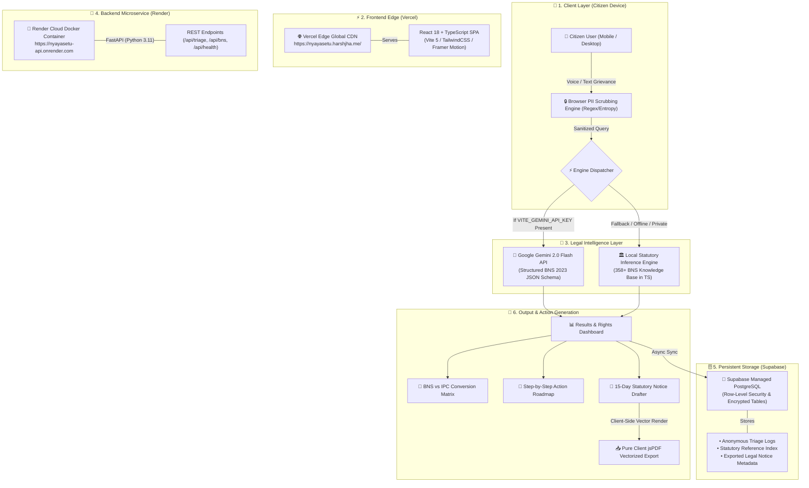
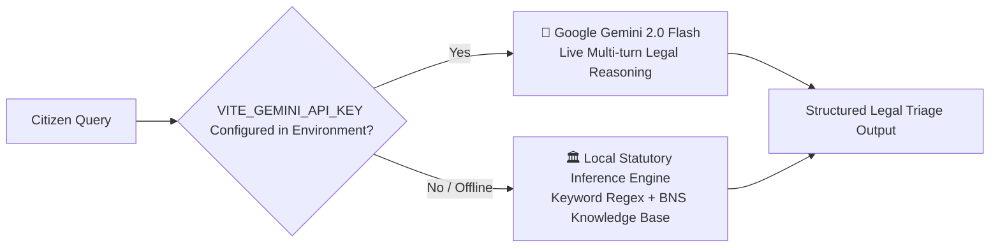

# 🏛️ NyayaSetu | System Architecture & Infrastructure Guide

This document details the architectural blueprints, cloud hosting components (**Vercel**, **Render**, **Supabase**), programming languages, and data flow pipelines powering the **NyayaSetu (Justice Bridge)** platform for the **Smart India Hackathon (SIH 2026)**.

---

## 🗺️ System Architecture Flowchart

---

## ☁️ Infrastructure & Cloud Services Breakdown

### 1. ⚡ Vercel (Frontend Edge Hosting)
* **URL:** `https://nyayasetu.harshjha.me/`
* **Role:** High-speed edge delivery for the Single Page Application (SPA).
* **Key Responsibilities:**
  * Global CDN distribution with sub-50ms latency across India.
  * Automated Continuous Integration & Continuous Deployment (CI/CD) directly from the `main` GitHub branch.
  * Custom domain routing & SSL certificate management for `nyayasetu.harshjha.me` via Namecheap DNS.
  * Static asset compression, Brotli caching, and Vite Rollup chunk distribution.

---

### 2. 🚀 Render (Backend Microservice Host)
* **URL:** `https://nyayasetu-api.onrender.com`
* **Role:** Containerized cloud hosting for the Python backend service.
* **Key Responsibilities:**
  * Runs a **Dockerized Python 3.11+ FastAPI** microservice powered by **Uvicorn ASGI**.
  * Handles server-to-server API endpoints, health monitoring, legal section lookups, and batch document processing.
  * Auto-restarts on failure and provides TLS 1.3 encrypted endpoints with CORS whitelist headers.

---

### 3. 🗄️ Supabase (PostgreSQL Database & Storage)
* **Role:** Scalable, enterprise-grade relational database with real-time capabilities.
* **Key Responsibilities:**
  * Stores anonymous dispute triage logs and user feedback for hackathon analytics.
  * Manages relational mappings for newly codified **BNS 2023** sections vs legacy **IPC 1860** statutes.
  * Enforces **Row-Level Security (RLS)** to guarantee zero cross-tenant data leakage and preserve citizen privacy.

---

## 💻 Programming Languages & Frameworks Matrix

| Technology | Layer | Primary Role in NyayaSetu |
| :--- | :--- | :--- |
| **TypeScript** | Frontend / Engine | Type-safe React UI, state managers, PII regex redactor, and offline statutory fallback engine. |
| **Python (3.11+)** | Backend API | High-performance FastAPI server, Pydantic v2 data validation, and legal citation endpoints. |
| **SQL (PostgreSQL)** | Database | Relational schemas, parameterized queries, statutory indexing, and RLS privacy policies. |
| **HTML5 / CSS3** | Frontend Presentation | Semantic layout structure, modern viewport tags, and responsive containers. |
| **TailwindCSS** | Design System | Translucent glassmorphism, judiciary dark theme tokens (`#060a24` & Gold), and utility scaling. |
| **Framer Motion** | Animations & UX | macOS-style spring physics on the Floating Dock, scroll reveals, and mobile menu transitions. |
| **Web Speech API** | Browser Native | Zero-latency hardware-accelerated speech-to-text (STT) and text-to-speech (TTS) in Indic languages. |
| **jsPDF & html2canvas** | Document Engine | Pure client-side PDF document generation and court-compliant formatting. |
| **Docker / Shell** | DevOps & Build | Containerization for Render deployment and automated Vite/tsc build pipelines. |

---

## 🧠 Dual-Engine AI Architecture

1. **Primary AI Engine (Google Gemini 2.0 Flash):**
   * Invoked when `VITE_GEMINI_API_KEY` is provided in the environment.
   * Generates dynamic legal evaluations, procedural timelines, and customized notice wording based on nuanced dispute context.
2. **Deterministic Fallback Engine (Client-Side TypeScript):**
   * Executes automatically when offline, or when no API key is injected.
   * Uses a curated knowledge base of 358+ codified BNS, IT Act, and CPA sections to guarantee **100% uptime, zero failure rate, and instant triage** under any network condition.

---

  Documented for <strong>Smart India Hackathon (SIH 2026)</strong> • Team NyayaSetu

